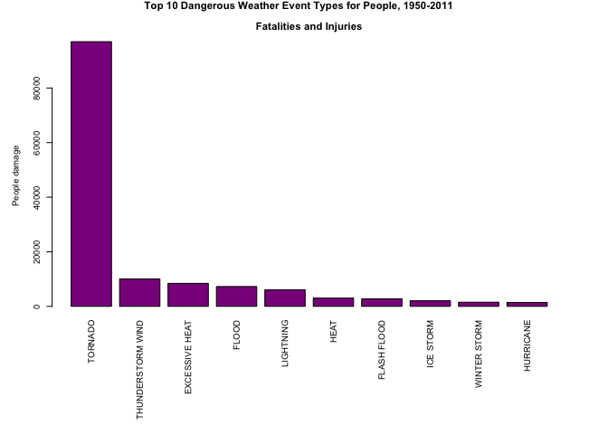
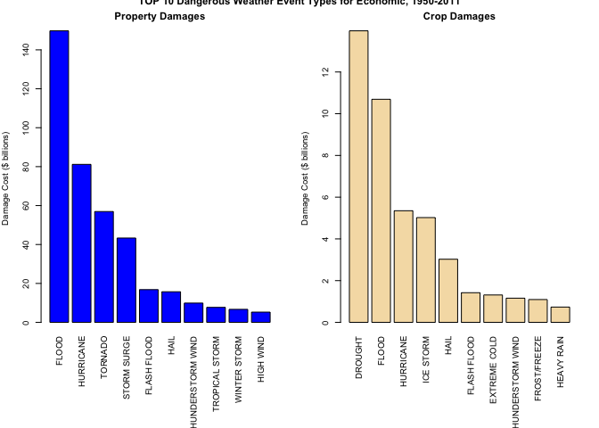

# Reproducible Research: Corse Project 2

*Dmitry Bazyukin*  
*April,2016*  

#Weather Events Impact To Population Health and The Economy In US, 1950-2011  
  
##Synopsis  
The National Climatic Data Center (NCDC) regularly receives Storm Data from the National Weathe Service (NWS). The National Weather service receive their information from a variety of sources. The NWS makes a best guess using all available data at the time of the publication. The damage amounts are received from a variety of sources, including those listed above in the Dat Sources section. Property and Crop damage should be considered as a broad estimate. Impact on Economic and People in this report will be measured by using estimates of injuries, fatalities, and property and crop damage. The aim of analusis performed is to answer for two questions:

 - Across the United States, which types of events are most harmful with respect to  -  population health?
 - Across the United States, which types of events have the greatest economic consequences?  
 
##Data Processing
Above all we set language preferences to English to avoid malfunction due to inapropriate settings:


```r
## To set it in english
Sys.setlocale("LC_TIME","en_US.UTF-8")
```

```
## [1] "en_US.UTF-8"
```

Then we load neccesary libraries and set the working directory

```r
##Loading neccesary libraries
library(ggplot2)
library(dplyr)
```

```
## 
## Attaching package: 'dplyr'
```

```
## Следующие объекты скрыты от 'package:stats':
## 
##     filter, lag
```

```
## Следующие объекты скрыты от 'package:base':
## 
##     intersect, setdiff, setequal, union
```

```r
library(knitr)
```

Storm Data can be loaded from the course website:


```r
##Downloading the file from the Internet source
url <- "https://d396qusza40orc.cloudfront.net/repdata%2Fdata%2FStormData.csv.bz2" 

if (!file.exists("stormData.csv.bz2")) {
        download.file(url, destfile = "stormData.csv.bz2", method ="curl")
}
```

Reading data to the StormData variable. We don't need to unzip initial file, because
read.csv function can handle compressed files and do this automatically.

```r
StormData <- read.csv('StormData.csv.bz2', header = T)
```

Make a quick view on the data:

```r
str(StormData)
```

```
## 'data.frame':	902297 obs. of  37 variables:
##  $ STATE__   : num  1 1 1 1 1 1 1 1 1 1 ...
##  $ BGN_DATE  : Factor w/ 16335 levels "1/1/1966 0:00:00",..: 6523 6523 4242 11116 2224 2224 2260 383 3980 3980 ...
##  $ BGN_TIME  : Factor w/ 3608 levels "00:00:00 AM",..: 272 287 2705 1683 2584 3186 242 1683 3186 3186 ...
##  $ TIME_ZONE : Factor w/ 22 levels "ADT","AKS","AST",..: 7 7 7 7 7 7 7 7 7 7 ...
##  $ COUNTY    : num  97 3 57 89 43 77 9 123 125 57 ...
##  $ COUNTYNAME: Factor w/ 29601 levels "","5NM E OF MACKINAC BRIDGE TO PRESQUE ISLE LT MI",..: 13513 1873 4598 10592 4372 10094 1973 23873 24418 4598 ...
##  $ STATE     : Factor w/ 72 levels "AK","AL","AM",..: 2 2 2 2 2 2 2 2 2 2 ...
##  $ EVTYPE    : Factor w/ 985 levels "   HIGH SURF ADVISORY",..: 834 834 834 834 834 834 834 834 834 834 ...
##  $ BGN_RANGE : num  0 0 0 0 0 0 0 0 0 0 ...
##  $ BGN_AZI   : Factor w/ 35 levels "","  N"," NW",..: 1 1 1 1 1 1 1 1 1 1 ...
##  $ BGN_LOCATI: Factor w/ 54429 levels ""," Christiansburg",..: 1 1 1 1 1 1 1 1 1 1 ...
##  $ END_DATE  : Factor w/ 6663 levels "","1/1/1993 0:00:00",..: 1 1 1 1 1 1 1 1 1 1 ...
##  $ END_TIME  : Factor w/ 3647 levels ""," 0900CST",..: 1 1 1 1 1 1 1 1 1 1 ...
##  $ COUNTY_END: num  0 0 0 0 0 0 0 0 0 0 ...
##  $ COUNTYENDN: logi  NA NA NA NA NA NA ...
##  $ END_RANGE : num  0 0 0 0 0 0 0 0 0 0 ...
##  $ END_AZI   : Factor w/ 24 levels "","E","ENE","ESE",..: 1 1 1 1 1 1 1 1 1 1 ...
##  $ END_LOCATI: Factor w/ 34506 levels ""," CANTON"," TULIA",..: 1 1 1 1 1 1 1 1 1 1 ...
##  $ LENGTH    : num  14 2 0.1 0 0 1.5 1.5 0 3.3 2.3 ...
##  $ WIDTH     : num  100 150 123 100 150 177 33 33 100 100 ...
##  $ F         : int  3 2 2 2 2 2 2 1 3 3 ...
##  $ MAG       : num  0 0 0 0 0 0 0 0 0 0 ...
##  $ FATALITIES: num  0 0 0 0 0 0 0 0 1 0 ...
##  $ INJURIES  : num  15 0 2 2 2 6 1 0 14 0 ...
##  $ PROPDMG   : num  25 2.5 25 2.5 2.5 2.5 2.5 2.5 25 25 ...
##  $ PROPDMGEXP: Factor w/ 19 levels "","-","?","+",..: 17 17 17 17 17 17 17 17 17 17 ...
##  $ CROPDMG   : num  0 0 0 0 0 0 0 0 0 0 ...
##  $ CROPDMGEXP: Factor w/ 9 levels "","?","0","2",..: 1 1 1 1 1 1 1 1 1 1 ...
##  $ WFO       : Factor w/ 542 levels ""," CI","%SD",..: 1 1 1 1 1 1 1 1 1 1 ...
##  $ STATEOFFIC: Factor w/ 250 levels "","ALABAMA, Central",..: 1 1 1 1 1 1 1 1 1 1 ...
##  $ ZONENAMES : Factor w/ 25112 levels "","                                                                                                                               "| __truncated__,..: 1 1 1 1 1 1 1 1 1 1 ...
##  $ LATITUDE  : num  3040 3042 3340 3458 3412 ...
##  $ LONGITUDE : num  8812 8755 8742 8626 8642 ...
##  $ LATITUDE_E: num  3051 0 0 0 0 ...
##  $ LONGITUDE_: num  8806 0 0 0 0 ...
##  $ REMARKS   : Factor w/ 436781 levels "","\t","\t\t",..: 1 1 1 1 1 1 1 1 1 1 ...
##  $ REFNUM    : num  1 2 3 4 5 6 7 8 9 10 ...
```

Select only fileds that we need to perform analysis to speed-up calculations:

```r
StormData2 <-StormData[,c("EVTYPE","FATALITIES","INJURIES","PROPDMG","PROPDMGEXP","CROPDMG","CROPDMGEXP")]
```

According to the page 12 of the [Storm Data Documentation](https://d396qusza40orc.cloudfront.net/repdata%2Fpeer2_doc%2Fpd01016005curr.pdf) :
"Estimates should be rounded to three significant digits, 
followed by an alphabetical character signifying the magnitude of the number,
i.e., 1.55B for $1,550,000,000. Alphabetical characters used to signify 
magnitude include “K” for thousands, “M” for millions, and “B” for billions."
So, we need to convert the values of impacts to its real size.

```r
##Lets view the multipliers
unique(StormData2$PROPDMGEXP)
```

```
##  [1] K M   B m + 0 5 6 ? 4 2 3 h 7 H - 1 8
## Levels:  - ? + 0 1 2 3 4 5 6 7 8 B h H K m M
```

```r
unique(StormData2$CROPDMGEXP)
```

```
## [1]   M K m B ? 0 k 2
## Levels:  ? 0 2 B k K m M
```

We see, that magnitude of number is not always alphabetical, and obviously, some
errors presented.

So, we convert alphabetical magnitude to numbers, numbers magnitude remains "as is" and we decided than they represents the multiplier.
Others symbols are considered errors and equipment malfunction.


```r
##Conver multipliers to sumarize and calculate effect:
##For property:

StormData2$PROPDMGEXP <- as.character(StormData2$PROPDMGEXP)
StormData2$PROPDMGEXP[(toupper(StormData2$PROPDMGEXP)=="K")] <- 3
StormData2$PROPDMGEXP[(toupper(StormData2$PROPDMGEXP)=="M")] <- 6
StormData2$PROPDMGEXP[(toupper(StormData2$PROPDMGEXP)=="B")] <- 9
StormData2$PROPDMGEXP[(toupper(StormData2$PROPDMGEXP)=="H")] <- 2
StormData2$PROPDMGEXP[(StormData2$PROPDMGEXP=="")|
                              (StormData2$PROPDMGEXP=="?")|
                              (StormData2$PROPDMGEXP=="-")|
                              (StormData2$PROPDMGEXP=="0")|
                              (StormData2$PROPDMGEXP=="+")] <- 0
StormData2$PROPDMGEXP <- as.numeric(StormData2$PROPDMGEXP)

##For crop:
StormData2$CROPDMGEXP <- as.character(StormData2$CROPDMGEXP)
StormData2$CROPDMGEXP[(toupper(StormData2$CROPDMGEXP)=="K")] <- 3
StormData2$CROPDMGEXP[(toupper(StormData2$CROPDMGEXP)=="M")] <- 6
StormData2$CROPDMGEXP[(toupper(StormData2$CROPDMGEXP)=="B")] <- 9
StormData2$CROPDMGEXP[(toupper(StormData2$CROPDMGEXP)=="H")] <- 2
StormData2$CROPDMGEXP[(StormData2$CROPDMGEXP=="")|
                              (StormData2$CROPDMGEXP=="?")] <- 0
StormData2$CROPDMGEXP <- as.numeric(StormData2$CROPDMGEXP)

## converting values to multipliers
StormData2$PROPDMG <- StormData2$PROPDMG*(10^StormData2$PROPDMGEXP)
StormData2$CROPDMG <- StormData2$CROPDMG*(10^StormData2$CROPDMGEXP)
```

According to the page 6 of  [Storm Data Documentation](https://d396qusza40orc.cloudfront.net/repdata%2Fpeer2_doc%2Fpd01016005curr.pdf) there is 48 types of dangerous 
weather events.
Lets look at the data presented:

```r
unique(StormData2$EVTYPE)
```

```
##   [1] TORNADO                        TSTM WIND                     
##   [3] HAIL                           FREEZING RAIN                 
##   [5] SNOW                           ICE STORM/FLASH FLOOD         
##   [7] SNOW/ICE                       WINTER STORM                  
##   [9] HURRICANE OPAL/HIGH WINDS      THUNDERSTORM WINDS            
##  [11] RECORD COLD                    HURRICANE ERIN                
##  [13] HURRICANE OPAL                 HEAVY RAIN                    
##  [15] LIGHTNING                      THUNDERSTORM WIND             
##  [17] DENSE FOG                      RIP CURRENT                   
##  [19] THUNDERSTORM WINS              FLASH FLOOD                   
##  [21] FLASH FLOODING                 HIGH WINDS                    
##  [23] FUNNEL CLOUD                   TORNADO F0                    
##  [25] THUNDERSTORM WINDS LIGHTNING   THUNDERSTORM WINDS/HAIL       
##  [27] HEAT                           WIND                          
##  [29] LIGHTING                       HEAVY RAINS                   
##  [31] LIGHTNING AND HEAVY RAIN       FUNNEL                        
##  [33] WALL CLOUD                     FLOODING                      
##  [35] THUNDERSTORM WINDS HAIL        FLOOD                         
##  [37] COLD                           HEAVY RAIN/LIGHTNING          
##  [39] FLASH FLOODING/THUNDERSTORM WI WALL CLOUD/FUNNEL CLOUD       
##  [41] THUNDERSTORM                   WATERSPOUT                    
##  [43] EXTREME COLD                   HAIL 1.75)                    
##  [45] LIGHTNING/HEAVY RAIN           HIGH WIND                     
##  [47] BLIZZARD                       BLIZZARD WEATHER              
##  [49] WIND CHILL                     BREAKUP FLOODING              
##  [51] HIGH WIND/BLIZZARD             RIVER FLOOD                   
##  [53] HEAVY SNOW                     FREEZE                        
##  [55] COASTAL FLOOD                  HIGH WIND AND HIGH TIDES      
##  [57] HIGH WIND/BLIZZARD/FREEZING RA HIGH TIDES                    
##  [59] HIGH WIND AND HEAVY SNOW       RECORD COLD AND HIGH WIND     
##  [61] RECORD HIGH TEMPERATURE        RECORD HIGH                   
##  [63] HIGH WINDS HEAVY RAINS         HIGH WIND/ BLIZZARD           
##  [65] ICE STORM                      BLIZZARD/HIGH WIND            
##  [67] HIGH WIND/LOW WIND CHILL       HEAVY SNOW/HIGH               
##  [69] RECORD LOW                     HIGH WINDS AND WIND CHILL     
##  [71] HEAVY SNOW/HIGH WINDS/FREEZING LOW TEMPERATURE RECORD        
##  [73] AVALANCHE                      MARINE MISHAP                 
##  [75] WIND CHILL/HIGH WIND           HIGH WIND/WIND CHILL/BLIZZARD 
##  [77] HIGH WIND/WIND CHILL           HIGH WIND/HEAVY SNOW          
##  [79] HIGH TEMPERATURE RECORD        FLOOD WATCH/                  
##  [81] RECORD HIGH TEMPERATURES       HIGH WIND/SEAS                
##  [83] HIGH WINDS/HEAVY RAIN          HIGH SEAS                     
##  [85] SEVERE TURBULENCE              RECORD RAINFALL               
##  [87] RECORD SNOWFALL                RECORD WARMTH                 
##  [89] HEAVY SNOW/WIND                EXTREME HEAT                  
##  [91] WIND DAMAGE                    DUST STORM                    
##  [93] APACHE COUNTY                  SLEET                         
##  [95] HAIL STORM                     FUNNEL CLOUDS                 
##  [97] FLASH FLOODS                   DUST DEVIL                    
##  [99] EXCESSIVE HEAT                 THUNDERSTORM WINDS/FUNNEL CLOU
## [101] WINTER STORM/HIGH WIND         WINTER STORM/HIGH WINDS       
## [103] GUSTY WINDS                    STRONG WINDS                  
## [105] FLOODING/HEAVY RAIN            SNOW AND WIND                 
## [107] HEAVY SURF COASTAL FLOODING    HEAVY SURF                    
## [109] HEAVY PRECIPATATION            URBAN FLOODING                
## [111] HIGH SURF                      BLOWING DUST                  
## [113] URBAN/SMALL                    WILD FIRES                    
## [115] HIGH                           URBAN/SMALL FLOODING          
## [117] WATER SPOUT                    HIGH WINDS DUST STORM         
## [119] WINTER STORM HIGH WINDS        LOCAL FLOOD                   
## [121] WINTER STORMS                  MUDSLIDES                     
## [123] RAINSTORM                      SEVERE THUNDERSTORM           
## [125] SEVERE THUNDERSTORMS           SEVERE THUNDERSTORM WINDS     
## [127] THUNDERSTORMS WINDS            DRY MICROBURST                
## [129] FLOOD/FLASH FLOOD              FLOOD/RAIN/WINDS              
## [131] WINDS                          DRY MICROBURST 61             
## [133] THUNDERSTORMS                  FLASH FLOOD WINDS             
## [135] URBAN/SMALL STREAM FLOODING    MICROBURST                    
## [137] STRONG WIND                    HIGH WIND DAMAGE              
## [139] STREAM FLOODING                URBAN AND SMALL               
## [141] HEAVY SNOWPACK                 ICE                           
## [143] FLASH FLOOD/                   DOWNBURST                     
## [145] GUSTNADO AND                   FLOOD/RAIN/WIND               
## [147] WET MICROBURST                 DOWNBURST WINDS               
## [149] DRY MICROBURST WINDS           DRY MIRCOBURST WINDS          
## [151] DRY MICROBURST 53              SMALL STREAM URBAN FLOOD      
## [153] MICROBURST WINDS               HIGH WINDS 57                 
## [155] DRY MICROBURST 50              HIGH WINDS 66                 
## [157] HIGH WINDS 76                  HIGH WINDS 63                 
## [159] HIGH WINDS 67                  BLIZZARD/HEAVY SNOW           
## [161] HEAVY SNOW/HIGH WINDS          BLOWING SNOW                  
## [163] HIGH WINDS 82                  HIGH WINDS 80                 
## [165] HIGH WINDS 58                  FREEZING DRIZZLE              
## [167] LIGHTNING THUNDERSTORM WINDSS  DRY MICROBURST 58             
## [169] HAIL 75                        HIGH WINDS 73                 
## [171] HIGH WINDS 55                  LIGHT SNOW AND SLEET          
## [173] URBAN FLOOD                    DRY MICROBURST 84             
## [175] THUNDERSTORM WINDS 60          HEAVY RAIN/FLOODING           
## [177] THUNDERSTORM WINDSS            TORNADOS                      
## [179] GLAZE                          RECORD HEAT                   
## [181] COASTAL FLOODING               HEAT WAVE                     
## [183] FIRST SNOW                     FREEZING RAIN AND SLEET       
## [185] UNSEASONABLY DRY               UNSEASONABLY WET              
## [187] WINTRY MIX                     WINTER WEATHER                
## [189] UNSEASONABLY COLD              EXTREME/RECORD COLD           
## [191] RIP CURRENTS HEAVY SURF        SLEET/RAIN/SNOW               
## [193] UNSEASONABLY WARM              DROUGHT                       
## [195] NORMAL PRECIPITATION           HIGH WINDS/FLOODING           
## [197] DRY                            RAIN/SNOW                     
## [199] SNOW/RAIN/SLEET                WATERSPOUT/TORNADO            
## [201] WATERSPOUTS                    WATERSPOUT TORNADO            
## [203] URBAN/SMALL STREAM FLOOD       STORM SURGE                   
## [205] WATERSPOUT-TORNADO             WATERSPOUT-                   
## [207] TORNADOES, TSTM WIND, HAIL     TROPICAL STORM ALBERTO        
## [209] TROPICAL STORM                 TROPICAL STORM GORDON         
## [211] TROPICAL STORM JERRY           LIGHTNING THUNDERSTORM WINDS  
## [213] WAYTERSPOUT                    MINOR FLOODING                
## [215] LIGHTNING INJURY               URBAN/SMALL STREAM  FLOOD     
## [217] LIGHTNING AND THUNDERSTORM WIN THUNDERSTORM WINDS53          
## [219] URBAN AND SMALL STREAM FLOOD   URBAN AND SMALL STREAM        
## [221] WILDFIRE                       DAMAGING FREEZE               
## [223] THUNDERSTORM WINDS 13          SMALL HAIL                    
## [225] HEAVY SNOW/HIGH WIND           HURRICANE                     
## [227] WILD/FOREST FIRE               SMALL STREAM FLOODING         
## [229] MUD SLIDE                      LIGNTNING                     
## [231] FROST                          FREEZING RAIN/SNOW            
## [233] HIGH WINDS/                    THUNDERSNOW                   
## [235] FLOODS                         EXTREME WIND CHILLS           
## [237] COOL AND WET                   HEAVY RAIN/SNOW               
## [239] SMALL STREAM AND URBAN FLOODIN SMALL STREAM/URBAN FLOOD      
## [241] SNOW/SLEET/FREEZING RAIN       SEVERE COLD                   
## [243] GLAZE ICE                      COLD WAVE                     
## [245] EARLY SNOW                     SMALL STREAM AND URBAN FLOOD  
## [247] HIGH  WINDS                    RURAL FLOOD                   
## [249] SMALL STREAM AND               MUD SLIDES                    
## [251] HAIL 80                        EXTREME WIND CHILL            
## [253] COLD AND WET CONDITIONS        EXCESSIVE WETNESS             
## [255] GRADIENT WINDS                 HEAVY SNOW/BLOWING SNOW       
## [257] SLEET/ICE STORM                THUNDERSTORM WINDS URBAN FLOOD
## [259] THUNDERSTORM WINDS SMALL STREA ROTATING WALL CLOUD           
## [261] LARGE WALL CLOUD               COLD AIR FUNNEL               
## [263] GUSTNADO                       COLD AIR FUNNELS              
## [265] BLOWING SNOW- EXTREME WIND CHI SNOW AND HEAVY SNOW           
## [267] GROUND BLIZZARD                MAJOR FLOOD                   
## [269] SNOW/HEAVY SNOW                FREEZING RAIN/SLEET           
## [271] ICE JAM FLOODING               SNOW- HIGH WIND- WIND CHILL   
## [273] STREET FLOOD                   COLD AIR TORNADO              
## [275] SMALL STREAM FLOOD             FOG                           
## [277] THUNDERSTORM WINDS 2           FUNNEL CLOUD/HAIL             
## [279] ICE/SNOW                       TSTM WIND 51                  
## [281] TSTM WIND 50                   TSTM WIND 52                  
## [283] TSTM WIND 55                   HEAVY SNOW/BLIZZARD           
## [285] THUNDERSTORM WINDS 61          HAIL 0.75                     
## [287] THUNDERSTORM DAMAGE            THUNDERTORM WINDS             
## [289] HAIL 1.00                      HAIL/WINDS                    
## [291] SNOW AND ICE                   WIND STORM                    
## [293] SNOWSTORM                      GRASS FIRES                   
## [295] LAKE FLOOD                     PROLONG COLD                  
## [297] HAIL/WIND                      HAIL 1.75                     
## [299] THUNDERSTORMW 50               WIND/HAIL                     
## [301] SNOW AND ICE STORM             URBAN AND SMALL STREAM FLOODIN
## [303] THUNDERSTORMS WIND             THUNDERSTORM  WINDS           
## [305] HEAVY SNOW/SLEET               AGRICULTURAL FREEZE           
## [307] DROUGHT/EXCESSIVE HEAT         TUNDERSTORM WIND              
## [309] TROPICAL STORM DEAN            THUNDERTSORM WIND             
## [311] THUNDERSTORM WINDS/ HAIL       THUNDERSTORM WIND/LIGHTNING   
## [313] HEAVY RAIN/SEVERE WEATHER      THUNDESTORM WINDS             
## [315] WATERSPOUT/ TORNADO            LIGHTNING.                    
## [317] WARM DRY CONDITIONS            HURRICANE-GENERATED SWELLS    
## [319] HEAVY SNOW/ICE STORM           RIVER AND STREAM FLOOD        
## [321] HIGH WIND 63                   COASTAL SURGE                 
## [323] HEAVY SNOW AND ICE STORM       MINOR FLOOD                   
## [325] HIGH WINDS/COASTAL FLOOD       RAIN                          
## [327] RIVER FLOODING                 SNOW/RAIN                     
## [329] ICE FLOES                      HIGH WAVES                    
## [331] SNOW SQUALLS                   SNOW SQUALL                   
## [333] THUNDERSTORM WIND G50          LIGHTNING FIRE                
## [335] BLIZZARD/FREEZING RAIN         HEAVY LAKE SNOW               
## [337] HEAVY SNOW/FREEZING RAIN       LAKE EFFECT SNOW              
## [339] HEAVY WET SNOW                 DUST DEVIL WATERSPOUT         
## [341] THUNDERSTORM WINDS/HEAVY RAIN  THUNDERSTROM WINDS            
## [343] THUNDERSTORM WINDS      LE CEN HAIL 225                      
## [345] BLIZZARD AND HEAVY SNOW        HEAVY SNOW AND ICE            
## [347] ICE STORM AND SNOW             HEAVY SNOW ANDBLOWING SNOW    
## [349] HEAVY SNOW/ICE                 BLIZZARD AND EXTREME WIND CHIL
## [351] LOW WIND CHILL                 BLOWING SNOW & EXTREME WIND CH
## [353] WATERSPOUT/                    URBAN/SMALL STREAM            
## [355] TORNADO F3                     FUNNEL CLOUD.                 
## [357] TORNDAO                        HAIL 0.88                     
## [359] FLOOD/RIVER FLOOD              MUD SLIDES URBAN FLOODING     
## [361] TORNADO F1                     THUNDERSTORM WINDS G          
## [363] DEEP HAIL                      GLAZE/ICE STORM               
## [365] HEAVY SNOW/WINTER STORM        AVALANCE                      
## [367] BLIZZARD/WINTER STORM          DUST STORM/HIGH WINDS         
## [369] ICE JAM                        FOREST FIRES                  
## [371] THUNDERSTORM WIND G60          FROST\\FREEZE                 
## [373] THUNDERSTORM WINDS.            HAIL 88                       
## [375] HAIL 175                       HVY RAIN                      
## [377] HAIL 100                       HAIL 150                      
## [379] HAIL 075                       THUNDERSTORM WIND G55         
## [381] HAIL 125                       THUNDERSTORM WINDS G60        
## [383] HARD FREEZE                    HAIL 200                      
## [385] THUNDERSTORM WINDS FUNNEL CLOU THUNDERSTORM WINDS 62         
## [387] WILDFIRES                      RECORD HEAT WAVE              
## [389] HEAVY SNOW AND HIGH WINDS      HEAVY SNOW/HIGH WINDS & FLOOD 
## [391] HAIL FLOODING                  THUNDERSTORM WINDS/FLASH FLOOD
## [393] HIGH WIND 70                   WET SNOW                      
## [395] HEAVY RAIN AND FLOOD           LOCAL FLASH FLOOD             
## [397] THUNDERSTORM WINDS 53          FLOOD/FLASH FLOODING          
## [399] TORNADO/WATERSPOUT             RAIN AND WIND                 
## [401] THUNDERSTORM WIND 59           THUNDERSTORM WIND 52          
## [403] COASTAL/TIDAL FLOOD            SNOW/ICE STORM                
## [405] BELOW NORMAL PRECIPITATION     RIP CURRENTS/HEAVY SURF       
## [407] FLASH FLOOD/FLOOD              EXCESSIVE RAIN                
## [409] RECORD/EXCESSIVE HEAT          HEAT WAVES                    
## [411] LIGHT SNOW                     THUNDERSTORM WIND 69          
## [413] HAIL DAMAGE                    LIGHTNING DAMAGE              
## [415] RECORD TEMPERATURES            LIGHTNING AND WINDS           
## [417] FOG AND COLD TEMPERATURES      OTHER                         
## [419] RECORD SNOW                    SNOW/COLD                     
## [421] FLASH FLOOD FROM ICE JAMS      TSTM WIND G58                 
## [423] MUDSLIDE                       HEAVY SNOW SQUALLS            
## [425] HEAVY SNOW/SQUALLS             HEAVY SNOW-SQUALLS            
## [427] ICY ROADS                      HEAVY MIX                     
## [429] SNOW FREEZING RAIN             LACK OF SNOW                  
## [431] SNOW/SLEET                     SNOW/FREEZING RAIN            
## [433] SNOW DROUGHT                   THUNDERSTORMW WINDS           
## [435] THUNDERSTORM WIND 60 MPH       THUNDERSTORM WIND 65MPH       
## [437] THUNDERSTORM WIND/ TREES       THUNDERSTORM WIND/AWNING      
## [439] THUNDERSTORM WIND 98 MPH       THUNDERSTORM WIND TREES       
## [441] TORRENTIAL RAIN                TORNADO F2                    
## [443] RIP CURRENTS                   HURRICANE EMILY               
## [445] HURRICANE GORDON               HURRICANE FELIX               
## [447] THUNDERSTORM WIND 59 MPH       THUNDERSTORM WINDS 63 MPH     
## [449] THUNDERSTORM WIND/ TREE        THUNDERSTORM DAMAGE TO        
## [451] THUNDERSTORM WIND 65 MPH       FLASH FLOOD - HEAVY RAIN      
## [453] THUNDERSTORM WIND.             FLASH FLOOD/ STREET           
## [455] THUNDERSTORM WIND 59 MPH.      HEAVY SNOW   FREEZING RAIN    
## [457] DAM FAILURE                    THUNDERSTORM HAIL             
## [459] HAIL 088                       THUNDERSTORM WINDSHAIL        
## [461] LIGHTNING  WAUSEON             THUDERSTORM WINDS             
## [463] ICE AND SNOW                   RECORD COLD/FROST             
## [465] STORM FORCE WINDS              FREEZING RAIN AND SNOW        
## [467] FREEZING RAIN SLEET AND        SOUTHEAST                     
## [469] HEAVY SNOW & ICE               FREEZING DRIZZLE AND FREEZING 
## [471] THUNDERSTORM WINDS AND         HAIL/ICY ROADS                
## [473] FLASH FLOOD/HEAVY RAIN         HEAVY RAIN; URBAN FLOOD WINDS;
## [475] HEAVY PRECIPITATION            TSTM WIND DAMAGE              
## [477] HIGH WATER                     FLOOD FLASH                   
## [479] RAIN/WIND                      THUNDERSTORM WINDS 50         
## [481] THUNDERSTORM WIND G52          FLOOD FLOOD/FLASH             
## [483] THUNDERSTORM WINDS 52          SNOW SHOWERS                  
## [485] THUNDERSTORM WIND G51          HEAT WAVE DROUGHT             
## [487] HEAVY SNOW/BLIZZARD/AVALANCHE  RECORD SNOW/COLD              
## [489] WET WEATHER                    UNSEASONABLY WARM AND DRY     
## [491] FREEZING RAIN SLEET AND LIGHT  RECORD/EXCESSIVE RAINFALL     
## [493] TIDAL FLOOD                    BEACH EROSIN                  
## [495] THUNDERSTORM WIND G61          FLOOD/FLASH                   
## [497] LOW TEMPERATURE                SLEET & FREEZING RAIN         
## [499] HEAVY RAINS/FLOODING           THUNDERESTORM WINDS           
## [501] THUNDERSTORM WINDS/FLOODING    THUNDEERSTORM WINDS           
## [503] HIGHWAY FLOODING               THUNDERSTORM W INDS           
## [505] HYPOTHERMIA                    FLASH FLOOD/ FLOOD            
## [507] THUNDERSTORM WIND 50           THUNERSTORM WINDS             
## [509] HEAVY RAIN/MUDSLIDES/FLOOD     MUD/ROCK SLIDE                
## [511] HIGH WINDS/COLD                BEACH EROSION/COASTAL FLOOD   
## [513] COLD/WINDS                     SNOW/ BITTER COLD             
## [515] THUNDERSTORM WIND 56           SNOW SLEET                    
## [517] DRY HOT WEATHER                COLD WEATHER                  
## [519] RAPIDLY RISING WATER           HAIL ALOFT                    
## [521] EARLY FREEZE                   ICE/STRONG WINDS              
## [523] EXTREME WIND CHILL/BLOWING SNO SNOW/HIGH WINDS               
## [525] HIGH WINDS/SNOW                EARLY FROST                   
## [527] SNOWMELT FLOODING              HEAVY SNOW AND STRONG WINDS   
## [529] SNOW ACCUMULATION              BLOWING SNOW/EXTREME WIND CHIL
## [531] SNOW/ ICE                      SNOW/BLOWING SNOW             
## [533] TORNADOES                      THUNDERSTORM WIND/HAIL        
## [535] FLASH FLOODING/FLOOD           HAIL 275                      
## [537] HAIL 450                       FLASH FLOOODING               
## [539] EXCESSIVE RAINFALL             THUNDERSTORMW                 
## [541] HAILSTORM                      TSTM WINDS                    
## [543] BEACH FLOOD                    HAILSTORMS                    
## [545] TSTMW                          FUNNELS                       
## [547] TSTM WIND 65)                  THUNDERSTORM WINDS/ FLOOD     
## [549] HEAVY RAINFALL                 HEAT/DROUGHT                  
## [551] HEAT DROUGHT                   NEAR RECORD SNOW              
## [553] LANDSLIDE                      HIGH WIND AND SEAS            
## [555] THUNDERSTORMWINDS              THUNDERSTORM WINDS HEAVY RAIN 
## [557] SLEET/SNOW                     EXCESSIVE                     
## [559] SNOW/SLEET/RAIN                WILD/FOREST FIRES             
## [561] HEAVY SEAS                     DUSTSTORM                     
## [563] FLOOD & HEAVY RAIN             ?                             
## [565] THUNDERSTROM WIND              FLOOD/FLASHFLOOD              
## [567] SNOW AND COLD                  HOT PATTERN                   
## [569] PROLONG COLD/SNOW              BRUSH FIRES                   
## [571] SNOW\\COLD                     WINTER MIX                    
## [573] EXCESSIVE PRECIPITATION        SNOWFALL RECORD               
## [575] HOT/DRY PATTERN                DRY PATTERN                   
## [577] MILD/DRY PATTERN               MILD PATTERN                  
## [579] LANDSLIDES                     HEAVY SHOWERS                 
## [581] HEAVY SNOW AND                 HIGH WIND 48                  
## [583] LAKE-EFFECT SNOW               BRUSH FIRE                    
## [585] WATERSPOUT FUNNEL CLOUD        URBAN SMALL STREAM FLOOD      
## [587] SAHARAN DUST                   HEAVY SHOWER                  
## [589] URBAN FLOOD LANDSLIDE          HEAVY SWELLS                  
## [591] URBAN SMALL                    URBAN FLOODS                  
## [593] SMALL STREAM                   HEAVY RAIN/URBAN FLOOD        
## [595] FLASH FLOOD/LANDSLIDE          LANDSLIDE/URBAN FLOOD         
## [597] HEAVY RAIN/SMALL STREAM URBAN  FLASH FLOOD LANDSLIDES        
## [599] EXTREME WINDCHILL              URBAN/SML STREAM FLD          
## [601] TSTM WIND/HAIL                 Other                         
## [603] Record dry month               Temperature record            
## [605] Minor Flooding                 Ice jam flood (minor          
## [607] High Wind                      Tstm Wind                     
## [609] ROUGH SURF                     Wind                          
## [611] Heavy Surf                     Dust Devil                    
## [613] Wind Damage                    Marine Accident               
## [615] Snow                           Freeze                        
## [617] Snow Squalls                   Coastal Flooding              
## [619] Heavy Rain                     Strong Wind                   
## [621] COASTAL STORM                  COASTALFLOOD                  
## [623] Erosion/Cstl Flood             Heavy Rain and Wind           
## [625] Light Snow/Flurries            Wet Month                     
## [627] Wet Year                       Tidal Flooding                
## [629] River Flooding                 Damaging Freeze               
## [631] Beach Erosion                  Hot and Dry                   
## [633] Flood/Flash Flood              Icy Roads                     
## [635] High Surf                      Heavy Rain/High Surf          
## [637] Thunderstorm Wind              Rain Damage                   
## [639] Unseasonable Cold              Early Frost                   
## [641] Wintry Mix                     blowing snow                  
## [643] STREET FLOODING                Record Cold                   
## [645] Extreme Cold                   Ice Fog                       
## [647] Excessive Cold                 Torrential Rainfall           
## [649] Freezing Rain                  Landslump                     
## [651] Late-season Snowfall           Hurricane Edouard             
## [653] Coastal Storm                  Flood                         
## [655] HEAVY RAIN/WIND                TIDAL FLOODING                
## [657] Winter Weather                 Snow squalls                  
## [659] Strong Winds                   Strong winds                  
## [661] RECORD WARM TEMPS.             Ice/Snow                      
## [663] Mudslide                       Glaze                         
## [665] Extended Cold                  Snow Accumulation             
## [667] Freezing Fog                   Drifting Snow                 
## [669] Whirlwind                      Heavy snow shower             
## [671] Heavy rain                     LATE SNOW                     
## [673] Record May Snow                Record Winter Snow            
## [675] Heavy Precipitation             COASTAL FLOOD                
## [677] Record temperature             Light snow                    
## [679] Late Season Snowfall           Gusty Wind                    
## [681] small hail                     Light Snow                    
## [683] MIXED PRECIP                   Black Ice                     
## [685] Mudslides                      Gradient wind                 
## [687] Snow and Ice                   Freezing Spray                
## [689] Summary Jan 17                 Summary of March 14           
## [691] Summary of March 23            Summary of March 24           
## [693] Summary of April 3rd           Summary of April 12           
## [695] Summary of April 13            Summary of April 21           
## [697] Summary August 11              Summary of April 27           
## [699] Summary of May 9-10            Summary of May 10             
## [701] Summary of May 13              Summary of May 14             
## [703] Summary of May 22 am           Summary of May 22 pm          
## [705] Heatburst                      Summary of May 26 am          
## [707] Summary of May 26 pm           Metro Storm, May 26           
## [709] Summary of May 31 am           Summary of May 31 pm          
## [711] Summary of June 3              Summary of June 4             
## [713] Summary June 5-6               Summary June 6                
## [715] Summary of June 11             Summary of June 12            
## [717] Summary of June 13             Summary of June 15            
## [719] Summary of June 16             Summary June 18-19            
## [721] Summary of June 23             Summary of June 24            
## [723] Summary of June 30             Summary of July 2             
## [725] Summary of July 3              Summary of July 11            
## [727] Summary of July 22             Summary July 23-24            
## [729] Summary of July 26             Summary of July 29            
## [731] Summary of August 1            Summary August 2-3            
## [733] Summary August 7               Summary August 9              
## [735] Summary August 10              Summary August 17             
## [737] Summary August 21              Summary August 28             
## [739] Summary September 4            Summary September 20          
## [741] Summary September 23           Summary Sept. 25-26           
## [743] Summary: Oct. 20-21            Summary: October 31           
## [745] Summary: Nov. 6-7              Summary: Nov. 16              
## [747] Microburst                     wet micoburst                 
## [749] Hail(0.75)                     Funnel Cloud                  
## [751] Urban Flooding                 No Severe Weather             
## [753] Urban flood                    Urban Flood                   
## [755] Cold                           Summary of May 22             
## [757] Summary of June 6              Summary August 4              
## [759] Summary of June 10             Summary of June 18            
## [761] Summary September 3            Summary: Sept. 18             
## [763] Coastal Flood                  coastal flooding              
## [765] Small Hail                     Record Temperatures           
## [767] Light Snowfall                 Freezing Drizzle              
## [769] Gusty wind/rain                GUSTY WIND/HVY RAIN           
## [771] Blowing Snow                   Early snowfall                
## [773] Monthly Snowfall               Record Heat                   
## [775] Seasonal Snowfall              Monthly Rainfall              
## [777] Cold Temperature               Sml Stream Fld                
## [779] Heat Wave                      MUDSLIDE/LANDSLIDE            
## [781] Saharan Dust                   Volcanic Ash                  
## [783] Volcanic Ash Plume             Thundersnow shower            
## [785] NONE                           COLD AND SNOW                 
## [787] DAM BREAK                      TSTM WIND (G45)               
## [789] SLEET/FREEZING RAIN            BLACK ICE                     
## [791] BLOW-OUT TIDES                 UNSEASONABLY COOL             
## [793] TSTM HEAVY RAIN                Gusty Winds                   
## [795] GUSTY WIND                     TSTM WIND 40                  
## [797] TSTM WIND 45                   TSTM WIND (41)                
## [799] TSTM WIND (G40)                TSTM WND                      
## [801] Wintry mix                      TSTM WIND                    
## [803] Frost                          Frost/Freeze                  
## [805] RAIN (HEAVY)                   Record Warmth                 
## [807] Prolong Cold                   Cold and Frost                
## [809] URBAN/SML STREAM FLDG          STRONG WIND GUST              
## [811] LATE FREEZE                    BLOW-OUT TIDE                 
## [813] Hypothermia/Exposure           HYPOTHERMIA/EXPOSURE          
## [815] Lake Effect Snow               Mixed Precipitation           
## [817] Record High                    COASTALSTORM                  
## [819] Snow and sleet                 Freezing rain                 
## [821] Gusty winds                    Blizzard Summary              
## [823] SUMMARY OF MARCH 24-25         SUMMARY OF MARCH 27           
## [825] SUMMARY OF MARCH 29            GRADIENT WIND                 
## [827] Icestorm/Blizzard              Flood/Strong Wind             
## [829] TSTM WIND AND LIGHTNING        gradient wind                 
## [831] Freezing drizzle               Mountain Snows                
## [833] URBAN/SMALL STRM FLDG          Heavy surf and wind           
## [835] Mild and Dry Pattern           COLD AND FROST                
## [837] TYPHOON                        HIGH SWELLS                   
## [839] HIGH  SWELLS                   VOLCANIC ASH                  
## [841] DRY SPELL                       LIGHTNING                    
## [843] BEACH EROSION                  UNSEASONAL RAIN               
## [845] EARLY RAIN                     PROLONGED RAIN                
## [847] WINTERY MIX                    COASTAL FLOODING/EROSION      
## [849] HOT SPELL                      UNSEASONABLY HOT              
## [851]  TSTM WIND (G45)               TSTM WIND  (G45)              
## [853] HIGH WIND (G40)                TSTM WIND (G35)               
## [855] DRY WEATHER                    ABNORMAL WARMTH               
## [857] UNUSUAL WARMTH                 WAKE LOW WIND                 
## [859] MONTHLY RAINFALL               COLD TEMPERATURES             
## [861] COLD WIND CHILL TEMPERATURES   MODERATE SNOW                 
## [863] MODERATE SNOWFALL              URBAN/STREET FLOODING         
## [865] COASTAL EROSION                UNUSUAL/RECORD WARMTH         
## [867] BITTER WIND CHILL              BITTER WIND CHILL TEMPERATURES
## [869] SEICHE                         TSTM                          
## [871] COASTAL  FLOODING/EROSION      UNSEASONABLY WARM YEAR        
## [873] HYPERTHERMIA/EXPOSURE          ROCK SLIDE                    
## [875] ICE PELLETS                    PATCHY DENSE FOG              
## [877] RECORD COOL                    RECORD WARM                   
## [879] HOT WEATHER                    RECORD TEMPERATURE            
## [881] TROPICAL DEPRESSION            VOLCANIC ERUPTION             
## [883] COOL SPELL                     WIND ADVISORY                 
## [885] GUSTY WIND/HAIL                RED FLAG FIRE WX              
## [887] FIRST FROST                    EXCESSIVELY DRY               
## [889] SNOW AND SLEET                 LIGHT SNOW/FREEZING PRECIP    
## [891] VOG                            MONTHLY PRECIPITATION         
## [893] MONTHLY TEMPERATURE            RECORD DRYNESS                
## [895] EXTREME WINDCHILL TEMPERATURES MIXED PRECIPITATION           
## [897] DRY CONDITIONS                 REMNANTS OF FLOYD             
## [899] EARLY SNOWFALL                 FREEZING FOG                  
## [901] LANDSPOUT                      DRIEST MONTH                  
## [903] RECORD  COLD                   LATE SEASON HAIL              
## [905] EXCESSIVE SNOW                 DRYNESS                       
## [907] FLOOD/FLASH/FLOOD              WIND AND WAVE                 
## [909] LIGHT FREEZING RAIN             WIND                         
## [911] MONTHLY SNOWFALL               RECORD PRECIPITATION          
## [913] ICE ROADS                      ROUGH SEAS                    
## [915] UNSEASONABLY WARM/WET          UNSEASONABLY COOL & WET       
## [917] UNUSUALLY WARM                 TSTM WIND G45                 
## [919] NON SEVERE HAIL                NON-SEVERE WIND DAMAGE        
## [921] UNUSUALLY COLD                 WARM WEATHER                  
## [923] LANDSLUMP                      THUNDERSTORM WIND (G40)       
## [925] UNSEASONABLY WARM & WET         FLASH FLOOD                  
## [927] LOCALLY HEAVY RAIN             WIND GUSTS                    
## [929] UNSEASONAL LOW TEMP            HIGH SURF ADVISORY            
## [931] LATE SEASON SNOW               GUSTY LAKE WIND               
## [933] ABNORMALLY DRY                 WINTER WEATHER MIX            
## [935] RED FLAG CRITERIA              WND                           
## [937] CSTL FLOODING/EROSION          SMOKE                         
## [939]  WATERSPOUT                    SNOW ADVISORY                 
## [941] EXTREMELY WET                  UNUSUALLY LATE SNOW           
## [943] VERY DRY                       RECORD LOW RAINFALL           
## [945] ROGUE WAVE                     PROLONG WARMTH                
## [947] ACCUMULATED SNOWFALL           FALLING SNOW/ICE              
## [949] DUST DEVEL                     NON-TSTM WIND                 
## [951] NON TSTM WIND                  GUSTY THUNDERSTORM WINDS      
## [953] PATCHY ICE                     HEAVY RAIN EFFECTS            
## [955] EXCESSIVE HEAT/DROUGHT         NORTHERN LIGHTS               
## [957] MARINE TSTM WIND                  HIGH SURF ADVISORY         
## [959] HAZARDOUS SURF                 FROST/FREEZE                  
## [961] WINTER WEATHER/MIX             ASTRONOMICAL HIGH TIDE        
## [963] WHIRLWIND                      VERY WARM                     
## [965] ABNORMALLY WET                 TORNADO DEBRIS                
## [967] EXTREME COLD/WIND CHILL        ICE ON ROAD                   
## [969] DROWNING                       GUSTY THUNDERSTORM WIND       
## [971] MARINE HAIL                    HIGH SURF ADVISORIES          
## [973] HURRICANE/TYPHOON              HEAVY SURF/HIGH SURF          
## [975] SLEET STORM                    STORM SURGE/TIDE              
## [977] COLD/WIND CHILL                MARINE HIGH WIND              
## [979] TSUNAMI                        DENSE SMOKE                   
## [981] LAKESHORE FLOOD                MARINE THUNDERSTORM WIND      
## [983] MARINE STRONG WIND             ASTRONOMICAL LOW TIDE         
## [985] VOLCANIC ASHFALL              
## 985 Levels:    HIGH SURF ADVISORY  COASTAL FLOOD ... WND
```

As we can see, much more event types is presented.
Some event type are called in different way, so to be more accurate we convert them.

```r
##convert strings to upper case for better matching
StormData2$EVTYPE<- toupper(StormData2$EVTYPE)

StormData2[StormData2$EVTYPE == "TSTM WIND", ]$EVTYPE = "THUNDERSTORM WIND"
StormData2[StormData2$EVTYPE == "THUNDERSTORM WINDS", ]$EVTYPE = "THUNDERSTORM WIND"
StormData2[StormData2$EVTYPE == "RIVER FLOOD", ]$EVTYPE = "FLOOD"
StormData2[StormData2$EVTYPE == "HURRICANE/TYPHOON", ]$EVTYPE = "HURRICANE"
```

Counting damages and impact for people and economic.
To avoid messy data lets limit damage factors to count 10

```r
PeoplesDamages <- 
        StormData2%>%
        group_by(EVTYPE) %>% 
        summarize(DAMAGE = sum(INJURIES) + sum(FATALITIES))

EconomicDamages <-
        StormData2 %>%
        group_by(EVTYPE) %>% 
        summarize(DAMAGE = sum(PROPDMG) + sum(CROPDMG))

##Top 10 dangerous events for people and Economic
PDtop10 <- arrange(PeoplesDamages, desc(DAMAGE))[1:10,]
EDtop10 <- arrange(EconomicDamages, desc(DAMAGE))[1:10,]

CropDamages <-
        StormData2 %>%
        group_by(EVTYPE) %>% 
        summarize(DAMAGE = sum(CROPDMG))

PropDamages <-
        StormData2 %>%
        group_by(EVTYPE) %>% 
        summarize(DAMAGE = sum(PROPDMG))

#Top 10 dangerous events for Property and Crop
PrDtop10 <- arrange(PropDamages, desc(DAMAGE))[1:10,]
CDtop10 <- arrange(CropDamages, desc(DAMAGE))[1:10,]
```

The results are:

TOP-10 dangerous weather events for People:

```r
PDtop10
```

```
## Source: local data frame [10 x 2]
## 
##               EVTYPE DAMAGE
##                (chr)  (dbl)
## 1            TORNADO  96979
## 2  THUNDERSTORM WIND  10054
## 3     EXCESSIVE HEAT   8428
## 4              FLOOD   7263
## 5          LIGHTNING   6046
## 6               HEAT   3037
## 7        FLASH FLOOD   2755
## 8          ICE STORM   2064
## 9       WINTER STORM   1527
## 10         HURRICANE   1446
```

TOP-10 dangerous weather events for Economics (Property and Crop combined):

```r
EDtop10
```

```
## Source: local data frame [10 x 2]
## 
##               EVTYPE       DAMAGE
##                (chr)        (dbl)
## 1              FLOOD 160468082757
## 2          HURRICANE  86523941810
## 3            TORNADO  57362333946
## 4        STORM SURGE  43323541000
## 5               HAIL  18761221986
## 6        FLASH FLOOD  18243991078
## 7            DROUGHT  15018672000
## 8  THUNDERSTORM WIND  11072177014
## 9          ICE STORM   8967041360
## 10    TROPICAL STORM   8382236550
```

##Results
Plot the graphs that helps us to ansewer to questions, mentioned above:

 * Across the United States, which types of events are most harmful with respect to population health?
 
 It shows that tornadoes are most harmful to population health for both cases


```r
##Plotting the results
##Setting the Graph parameters
par(oma=c(5,1,1,2))
par(mfrow = c(1, 1), mar = c(7, 4, 3, 2), mgp = c(3, 1, 0), las=2, cex = 0.6)
##Peoples Damage (Fatalities and Injures)
barplot(PDtop10$DAMAGE, names.arg = PDtop10$EVTYPE, las = 3,
        main = "Fatalities and Injuries",
        ylab = "People damage",col = "magenta4")
title(main="Top 10 Dangerous Weather Event Types for People, 1950-2011",outer=T)
```



Analysis performed shows that Tornados are the most dangerous and harmful event for people.

 * Across the United States, which types of events have the greatest economic consequences?


```r
##Economic impact
par(mfrow = c(1, 2), mar = c(10, 4, 3, 2), mgp = c(3, 1, 0), las=2, cex = 0.6)

barplot(PrDtop10$DAMAGE/(1e9), names.arg = PrDtop10$EVTYPE, las = 3,
        main = "Property Damages",
        ylab = "Damage Cost ($ billions)",col = "blue")
barplot(CDtop10$DAMAGE/(1e9), names.arg = CDtop10$EVTYPE, las = 3,
        main = "Crop Damages",
        ylab = "Damage Cost ($ billions)",col = "wheat")
title(main="TOP 10 Dangerous Weather Event Types for Economic, 1950-2011",outer=T)
```



Analysis performed shows thar Flood is the most dangerous event for propery, Hurricane and Tornados are at the 2nd and 3rd places respectively.

Drought is the most dangerous event for Crop, Flood and Ice storm are at the 2nd and 3rd places respectively.
